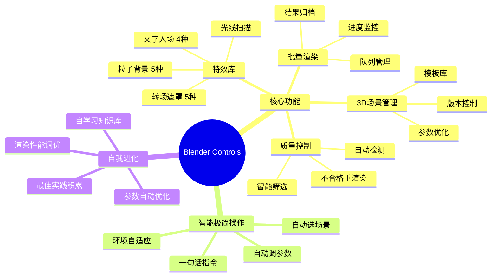

[](https://www.python.org/)
[](LICENSE)
[](https://www.blender.org/)

# Blender Controls Skill

> **Blender 智能管理与控制框架** —— 让 Blender 从工具变成自动出3D产品的智能体。场景管理 + 特效库 + 批量渲染 + 质量控制，全链路自动化。

## 姊妹项目（航空母舰战斗群）

| 项目 | 定位 | 角色 |
|------|------|------|
| [ai-video-editor](https://github.com/beimeibeile/ai-video-editor) | AI视频剪辑框架 | 🚢 航空母舰 |
| [anysearch-skill](https://github.com/beimeibeile/anysearch-skill) | 深度搜索技能 | 📡 雷达 |
| [Comfyui-controls-skill](https://github.com/beimeibeile/Comfyui-controls-skill) | ComfyUI智能管理 | 🚀 导弹 |
| **Blender-controls-skill** | Blender智能管理（本项目） | 🚀 新导弹 |

## 架构脑图



## 核心能力

| 能力 | 说明 |
|------|------|
| **3D场景管理** | 场景模板库、版本控制、参数优化、一键运行 |
| **特效库** | 粒子背景、文字动画、转场遮罩、光线扫描、3D片头 |
| **批量渲染** | 批量渲染、队列管理、进度监控、结果归档 |
| **质量门控制** | 渲染结果质量检测、自动筛选、不合格重渲染 |
| **API统一封装** | 统一接口调用Blender，屏蔽版本差异（4.x/5.x） |
| **自我学习进化** | 从渲染结果中学习优化参数、积累最佳实践 |
| **算力监控** | GPU使用监控、渲染队列管理、资源调度 |
| **环境自适应** | 自动检测Blender版本、可用插件、渲染引擎 |

## 快速开始

```bash
# 1. 克隆项目
git clone https://github.com/beimeibeile/Blender-controls-skill.git
cd Blender-controls-skill

# 2. 配置环境
cp .env.example .env
# 编辑 .env，填入 Blender 路径

# 3. 验证连接
python -c "from capabilities.cap_api_wrapper import BlenderAPI; api = BlenderAPI(); print(api.get_version())"
```

## 环境要求

| 组件 | 必需？ | 说明 |
|------|--------|------|
| **Python** | ✅ 必需 | ≥ 3.10 |
| **Blender** | ✅ 必需 | 4.x 或 5.x，默认 5.2 |
| **GPU** | ⚡ 推荐 | NVIDIA CUDA，显存 ≥ 8GB |
| **FFmpeg** | 可选 | 视频后处理 |

## 项目架构

```
Blender-controls-skill/
├── capabilities/              # 能力模块（可插拔）
│   ├── cap_scene_manager/         # 3D场景管理
│   ├── cap_effects_library/       # 特效库
│   ├── cap_batch_renderer/        # 批量渲染
│   ├── cap_quality_control/       # 质量控制
│   ├── cap_api_wrapper/           # API封装
│   └── cap_self_evolution/        # 自我进化
├── scenes/                    # 场景模板库
├── knowledge/                 # 知识库（自学习）
├── scripts/                   # 工具脚本
├── utils/                     # 工具函数
├── SKILL.md                   # 技能定义
└── README.md                  # 项目说明
```

## License

[MIT](LICENSE)
